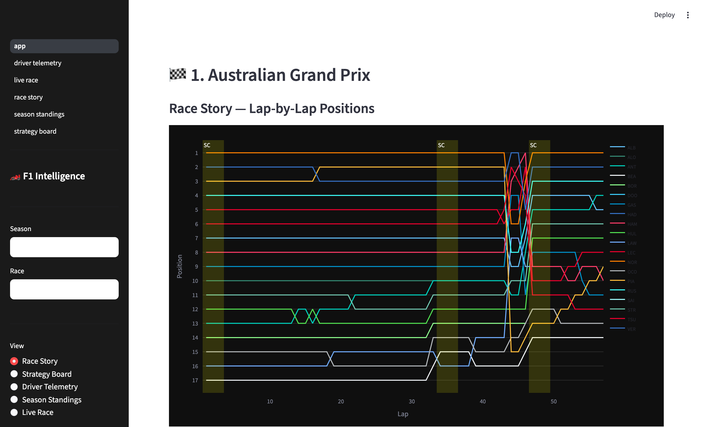
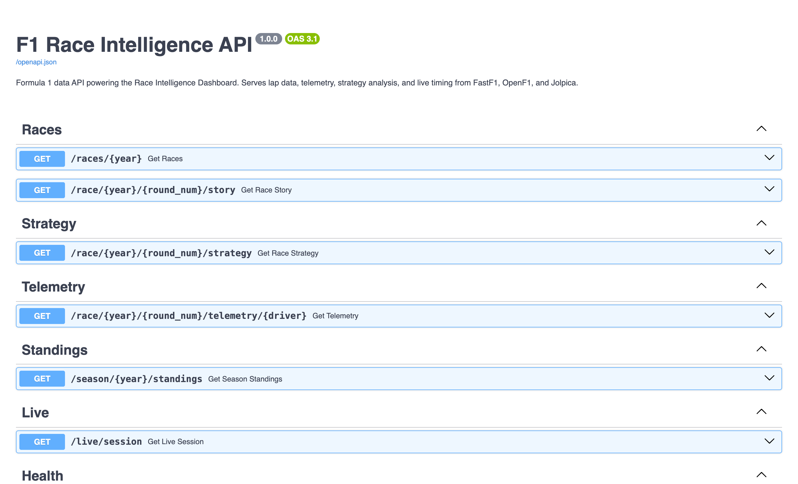

# 🏎️ F1 Race Intelligence Dashboard

An interactive Formula 1 data explorer with live telemetry, strategy analysis, and race storytelling — built entirely on **free, open data sources**.

> **Run it in 2 commands:**
> ```bash
> git clone https://github.com/AkshayTharval/f1-race-intelligence.git
> cd f1-race-intelligence && docker-compose up
> ```
> Then open **http://localhost:8501**

---

## Screenshots

### Race Story — Lap-by-Lap Positions
> Each driver gets their official team colour. Click any driver name in the legend to isolate them (grey out all others). Use the multiselect above the chart to pin multiple drivers for comparison.



### API — Auto-generated Swagger Docs at `/docs`


---

## Features

| View | What it shows |
|------|--------------|
| **Race Story** | Lap-by-lap position chart for all 20 drivers with safety car / VSC / red flag period annotations. Click legend to isolate drivers. |
| **Strategy Board** | Tyre stint Gantt chart with official compound colours + undercut/overcut detector per pit stop |
| **Driver Telemetry** | Smoothed fastest-lap overlay — speed, throttle, brake, gear comparison for any two drivers |
| **Season Standings** | Championship points progression, constructor standings, teammate head-to-head by round |
| **Live Race** | Real-time timing (auto-refreshes every 30s during live sessions; shows most recent race otherwise) |

---

## Architecture

```
┌─────────────────────────────────────────────────────────────┐
│                     docker-compose                          │
│                                                             │
│  ┌─────────────────────┐    ┌──────────────────────────┐   │
│  │   FastAPI Backend   │    │   Streamlit Dashboard    │   │
│  │   :8000             │◄───│   :8501                  │   │
│  │                     │    │                          │   │
│  │  /races/{year}      │    │  Race Story              │   │
│  │  /race/.../story    │    │  Strategy Board          │   │
│  │  /race/.../strategy │    │  Driver Telemetry        │   │
│  │  /race/.../telemetry│    │  Season Standings        │   │
│  │  /season/.../stand. │    │  Live Race               │   │
│  │  /live/session      │    │                          │   │
│  └──────────┬──────────┘    └──────────────────────────┘   │
│             │                                               │
│  ┌──────────▼──────────────────────────────┐               │
│  │           Data Layer                    │               │
│  │  FastF1 (disk cache ./f1_cache/)        │               │
│  │  OpenF1 API  (live + historical)        │               │
│  │  Jolpica API (historical back to 1950)  │               │
│  │  SQLite TTL cache (./data/cache/)       │               │
│  └─────────────────────────────────────────┘               │
└─────────────────────────────────────────────────────────────┘
```

---

## Data Sources

| Source | What it provides | Auth |
|--------|-----------------|------|
| [FastF1](https://docs.fastf1.dev/) | Lap data, telemetry, tyre compounds, session data, race control messages | None |
| [OpenF1 API](https://openf1.org/) | Live timing, pit stops, stints, driver info | None |
| [Jolpica / Ergast](https://jolpi.ca/) | Historical race results & standings back to 1950 | None |

**Cost: $0** — All data sources are completely free.

---

## Quick Start (Local, No Docker)

```bash
# 1. Clone and install
git clone https://github.com/AkshayTharval/f1-race-intelligence.git
cd f1-race-intelligence
pip install -r requirements.txt

# 2. Start the API backend (terminal 1)
uvicorn backend.main:app --host 0.0.0.0 --port 8000
# → API + Swagger docs at http://localhost:8000/docs

# 3. Start the dashboard (terminal 2)
streamlit run dashboard/app.py
# → Dashboard at http://localhost:8501
```

> **Python version:** Tested on Python 3.9 (Anaconda) and 3.12 (Homebrew). Uses `Optional[T]` type hints for 3.9 compatibility.

---

## API Reference

Auto-generated Swagger UI at **http://localhost:8000/docs**

| Endpoint | Description |
|----------|-------------|
| `GET /races/{year}` | List all races in a season with circuit info |
| `GET /race/{year}/{round}/story` | Lap-by-lap positions for all 20 drivers + race events (SC, VSC, red flags) |
| `GET /race/{year}/{round}/strategy` | Tyre stints, pit stops, undercut/overcut analysis |
| `GET /race/{year}/{round}/telemetry/{driver}` | Smoothed fastest-lap telemetry (speed, throttle, brake, gear) |
| `GET /season/{year}/standings` | Championship points progression round by round |
| `GET /live/session` | Current or most recent session with live timing |

All responses include `X-Cache: HIT/MISS` header. Cached in SQLite:
- **5 minutes** — live session data
- **24 hours** — historical race data (races, telemetry, standings)

---

## Tech Stack

- **Backend:** Python, FastAPI, uvicorn, aiosqlite
- **Data:** FastF1 3.7+, httpx (OpenF1 + Jolpica APIs)
- **Frontend:** Streamlit 1.35+, Plotly
- **Infrastructure:** Docker, Docker Compose, SQLite

---

## F1 Colour Standards

### Tyre Compounds
| Compound | Colour |
|---------|--------|
| Soft | 🔴 `#FF3333` |
| Medium | 🟡 `#FFF200` |
| Hard | ⚪ `#FFFFFF` |
| Intermediate | 🟢 `#39B54A` |
| Wet | 🔵 `#0067FF` |

### Driver / Team Colours
Team colours are hardcoded from official F1 branding (see `TEAM_COLOURS` in `backend/f1_data.py`). Teammates receive a brightened shade of their team colour to remain visually distinct on the position chart.

---

## Notes

- **First load** of a race session takes 30–60 seconds while FastF1 downloads timing data from the F1 timing server. All subsequent loads are instant (disk-cached in `./f1_cache/`).
- The `./f1_cache/` directory can grow to **several GB** for a full season of data.
- Race events (safety car, VSC) are read directly from FastF1's `race_control_messages` DataFrame which includes an exact `Lap` column — no time-based mapping needed.
- Jolpica API requires `.json` suffix on all endpoint URLs (e.g. `/2024.json`).

---

## Running Tests

The test suite uses **pytest** and **pytest-asyncio**. No network calls or FastF1 downloads are needed — all external dependencies are mocked.

### Install test dependencies

```bash
pip install -r requirements-dev.txt
```

> The main `requirements.txt` must also be installed (see Quick Start above).

### Run all tests

```bash
pytest
```

### Run a specific test file

```bash
pytest tests/test_cache.py          # TTL cache logic
pytest tests/test_f1_data.py        # Data processing & API parsing
pytest tests/test_strategy.py       # Undercut/overcut detector algorithm
pytest tests/test_routers.py        # HTTP endpoints (cache headers, 404s, etc.)
```

### Run with verbose output

```bash
pytest -v
```

### Test coverage

```bash
pip install pytest-cov
pytest --cov=backend --cov-report=term-missing
```

### What is tested

| Module | Tests cover |
|--------|------------|
| `backend/cache.py` | TTL constants, get/set round-trip, expiry, upsert, concurrent writes, idempotent `init_db` |
| `backend/f1_data.py` | Tyre colours, lap position extraction (NaN fill, retirement), tyre stints, race event parsing (VSC/SC/Red Flag/skips), driver colour logic (team lookup, teammate brightening, fallback palette), OpenF1/Jolpica data parsing |
| `backend/routers/strategy.py` | Undercut Success, Overcut Success, Undercut Failed, Neutral (no competitors, no lap data, unchanged position), edge cases |
| `backend/routers/*.py` | Health check, cache HIT/MISS headers, 404 on missing session, driver abbreviation uppercasing, position sorting, colour `#` prefix normalisation |

---

## Contributing

PRs welcome. Follow the visualisation rules in [CLAUDE.md](CLAUDE.md).

---

## License

MIT
